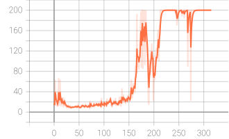

<H1>Homework</H1>

## 实现DQN算法

在`CartPole-v0`环境中实现DQN算法.最终算法性能的评判标准：环境最终的reward至少收敛至180.0.  

## Submission

作业提交内容：需提交一个zip文件，包括代码以及实验报告PDF。实验报告除了需要写writing部分的内容，还需要给出每题的reward曲线图以及算法。

zip文件命名格式: 20240621\_张三\_Final；如果需提交不同版本，则命名格式：20240621\_张三\_Final_v2等。

作业提交方式：超算习堂

**作业提交截止日期：2024年07月14日** 

# Supplement

我们给出`cartpole`环境的训练曲线图作为参考。

